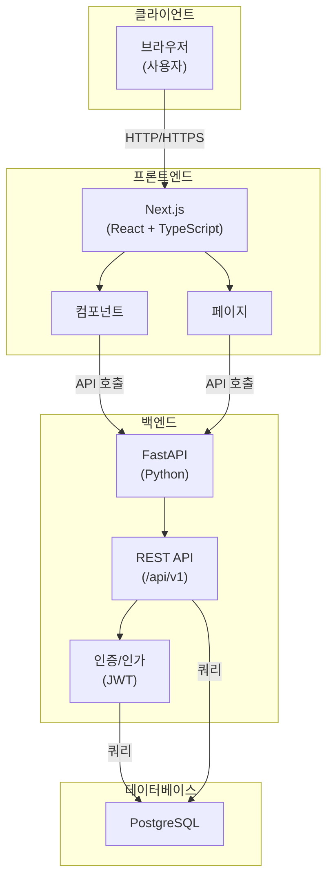
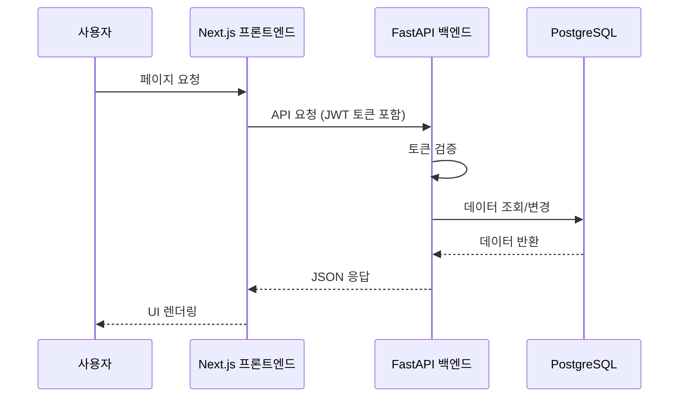
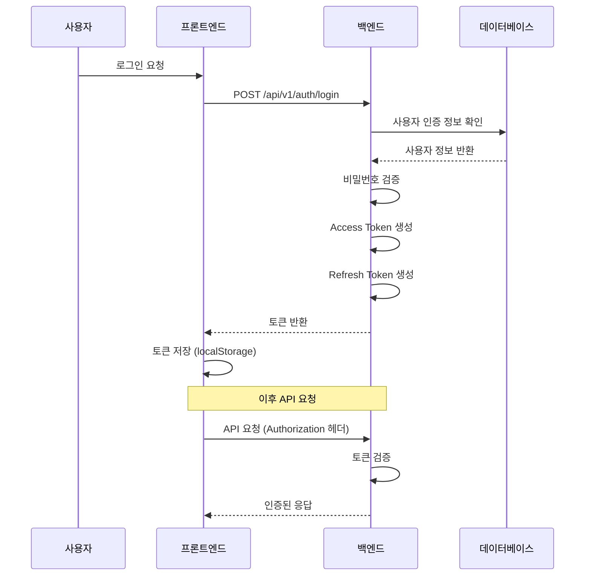

# 프론트엔드

Next.js 기반 프론트엔드 애플리케이션입니다.

## 기술 스택

- **Next.js**: React 기반 풀스택 프레임워크
- **TypeScript**: 타입 안정성을 위한 언어

## 사전 요구사항

- **Node.js** (v18 이상 권장)
- **npm** 또는 **yarn** 또는 **pnpm**

## 설치 및 실행

### 1. 의존성 설치

```powershell
# 프론트엔드 디렉토리로 이동
cd frontend

# 의존성 설치
npm install
```

### 2. 환경 변수 설정

프로젝트 루트 또는 `frontend` 디렉토리에 `.env.local` 파일을 생성하고 다음 내용을 추가하세요:

```env
# 백엔드 API URL
NEXT_PUBLIC_API_URL=http://localhost:8000
```

### 3. 개발 서버 실행

```powershell
# 개발 서버 실행
npm run dev
```

또는 별도 터미널에서:

```powershell
cd ./frontend; npm run dev
```

### 4. 접속

개발 서버가 실행되면 다음 URL에서 접속할 수 있습니다:

- **프론트엔드**: http://localhost:3000

## 프로젝트 구조

```
frontend/
├── app/                 # Next.js App Router (app 디렉토리)
│   ├── layout.tsx      # 루트 레이아웃
│   ├── page.tsx        # 홈 페이지
│   └── api/            # API 라우트 (선택사항)
├── components/         # 재사용 가능한 컴포넌트
├── lib/                # 유틸리티 함수 및 설정
├── public/             # 정적 파일
├── styles/             # 스타일 파일
├── types/              # TypeScript 타입 정의
├── .env.local          # 환경 변수 (로컬)
├── next.config.js      # Next.js 설정
├── package.json        # 의존성 및 스크립트
└── tsconfig.json       # TypeScript 설정
```

## 서비스 구성

### 시스템 아키텍처

프로젝트는 프론트엔드(Next.js), 백엔드(FastAPI), 데이터베이스(PostgreSQL)로 구성된 3계층 아키텍처를 따릅니다.



### API 통신 흐름



### 인증 흐름



### 주요 기능

프론트엔드는 다음 주요 기능을 제공합니다:

#### 1. 인증 및 인가
- **회원가입**: 새로운 사용자 계정 생성
- **로그인**: 이메일/비밀번호 기반 인증
- **토큰 관리**: Access Token 및 Refresh Token 자동 갱신
- **로그아웃**: 세션 종료 및 토큰 삭제

#### 2. 사용자 관리
- **프로필 조회**: 현재 로그인한 사용자 정보 조회
- **사용자 목록**: 전체 사용자 목록 조회 (관리자)
- **사용자 상세**: 특정 사용자 상세 정보 조회
- **프로필 수정**: 사용자 정보 업데이트
- **사용자 삭제**: 계정 삭제 (관리자)

#### 3. 역할 및 권한 관리
- **역할 관리**: 역할 생성, 조회, 수정, 삭제
- **권한 관리**: 권한 생성, 조회, 수정, 삭제
- **역할-권한 매핑**: 역할에 권한 할당/해제
- **사용자-역할 매핑**: 사용자에게 역할 할당/해제

#### 4. 파일 관리
- **파일 업로드**: 파일 메타데이터 등록
- **파일 목록**: 업로드된 파일 목록 조회
- **파일 상세**: 파일 정보 조회
- **파일 수정**: 파일 메타데이터 수정
- **파일 삭제**: 파일 삭제

#### 5. 다국어 지원
- **로케일 관리**: 다국어 리소스 생성, 조회, 수정, 삭제
- **언어별 리소스**: 언어 코드별 번역 리소스 관리
- **리소스 타입**: 라벨, 메시지, 에러 메시지 등 타입별 관리

#### 6. 감사 로그
- **로그 조회**: 시스템 활동 로그 조회
- **필터링**: 사용자, 액션 타입별 필터링
- **기간별 조회**: 날짜 범위별 로그 조회

#### 7. OAuth 계정 관리
- **OAuth 연동**: 소셜 로그인 계정 연동
- **계정 목록**: 연동된 OAuth 계정 조회
- **계정 해제**: OAuth 계정 연동 해제

### API 엔드포인트

백엔드 API는 RESTful 원칙을 따르며, 모든 엔드포인트는 `/api/v1` 접두사를 사용합니다.

#### 헬스 체크
- `GET /api/v1/health` - 서버 상태 확인

#### 인증 (`/api/v1/auth`)
- `POST /api/v1/auth/register` - 회원가입
- `POST /api/v1/auth/login` - 로그인
- `POST /api/v1/auth/logout` - 로그아웃
- `POST /api/v1/auth/refresh` - 토큰 갱신
- `POST /api/v1/auth/verify` - 토큰 검증

#### 사용자 관리 (`/api/v1/users`)
- `GET /api/v1/users/me` - 현재 사용자 정보 조회
- `GET /api/v1/users` - 사용자 목록 조회 (페이지네이션 지원)
- `GET /api/v1/users/{user_id}` - 사용자 상세 정보 조회
- `PUT /api/v1/users/me` - 현재 사용자 정보 수정
- `PUT /api/v1/users/{user_id}` - 사용자 정보 수정 (관리자)
- `DELETE /api/v1/users/{user_id}` - 사용자 삭제 (관리자)

#### 역할 관리 (`/api/v1/roles`)
- `GET /api/v1/roles` - 역할 목록 조회
- `GET /api/v1/roles/{role_id}` - 역할 상세 정보 조회
- `POST /api/v1/roles` - 역할 생성
- `PUT /api/v1/roles/{role_id}` - 역할 수정
- `DELETE /api/v1/roles/{role_id}` - 역할 삭제

#### 권한 관리 (`/api/v1/permissions`)
- `GET /api/v1/permissions` - 권한 목록 조회
- `GET /api/v1/permissions/{permission_id}` - 권한 상세 정보 조회
- `POST /api/v1/permissions` - 권한 생성
- `PUT /api/v1/permissions/{permission_id}` - 권한 수정
- `DELETE /api/v1/permissions/{permission_id}` - 권한 삭제

#### 역할-권한 매핑 (`/api/v1/role-permissions`)
- `GET /api/v1/role-permissions` - 역할-권한 매핑 목록 조회
- `GET /api/v1/role-permissions/{role_id}` - 특정 역할의 권한 목록 조회
- `POST /api/v1/role-permissions` - 역할에 권한 할당
- `DELETE /api/v1/role-permissions/{role_permission_id}` - 역할-권한 매핑 삭제

#### 사용자-역할 매핑 (`/api/v1/user-roles`)
- `GET /api/v1/user-roles` - 사용자-역할 매핑 목록 조회
- `GET /api/v1/user-roles/{user_id}` - 특정 사용자의 역할 목록 조회
- `POST /api/v1/user-roles` - 사용자에 역할 할당
- `DELETE /api/v1/user-roles/{user_role_id}` - 사용자-역할 매핑 삭제

#### OAuth 계정 (`/api/v1/oauth-accounts`)
- `GET /api/v1/oauth-accounts` - OAuth 계정 목록 조회
- `GET /api/v1/oauth-accounts/{oauth_account_id}` - OAuth 계정 상세 정보 조회
- `POST /api/v1/oauth-accounts` - OAuth 계정 연동
- `DELETE /api/v1/oauth-accounts/{oauth_account_id}` - OAuth 계정 연동 해제

#### 리프레시 토큰 (`/api/v1/refresh-tokens`)
- `GET /api/v1/refresh-tokens` - 리프레시 토큰 목록 조회
- `GET /api/v1/refresh-tokens/{token_id}` - 리프레시 토큰 상세 정보 조회
- `DELETE /api/v1/refresh-tokens/{token_id}` - 리프레시 토큰 삭제

#### 감사 로그 (`/api/v1/audit-logs`)
- `GET /api/v1/audit-logs` - 감사 로그 목록 조회 (필터링 및 페이지네이션 지원)
- `GET /api/v1/audit-logs/{log_id}` - 감사 로그 상세 정보 조회

#### 파일 관리 (`/api/v1/files`)
- `GET /api/v1/files` - 파일 목록 조회 (페이지네이션 지원)
- `GET /api/v1/files/{file_id}` - 파일 상세 정보 조회
- `POST /api/v1/files` - 파일 메타데이터 생성
- `PUT /api/v1/files/{file_id}` - 파일 메타데이터 수정
- `DELETE /api/v1/files/{file_id}` - 파일 삭제

#### 로케일 관리 (`/api/v1/locales`)
- `GET /api/v1/locales` - 다국어 리소스 목록 조회 (필터링 지원)
- `GET /api/v1/locales/{locale_id}` - 다국어 리소스 상세 정보 조회
- `POST /api/v1/locales` - 다국어 리소스 생성
- `PUT /api/v1/locales/{locale_id}` - 다국어 리소스 수정
- `DELETE /api/v1/locales/{locale_id}` - 다국어 리소스 삭제

### API 문서

백엔드 API의 상세한 문서는 다음 URL에서 확인할 수 있습니다:

- **Swagger UI**: http://localhost:8000/docs
- **ReDoc**: http://localhost:8000/redoc

## 코딩 컨벤션

### TypeScript/JavaScript 명명 규칙

- **변수/함수명**: 카멜 케이스 (예: `userName`, `getUserData`)
- **컴포넌트명**: 파스칼 케이스 (예: `UserProfile`, `StockCalculator`)
- **상수**: 대문자 스네이크 케이스 (예: `API_BASE_URL`, `MAX_RETRY_COUNT`)
- **인터페이스/타입**: 파스칼 케이스 (예: `UserData`, `ApiResponse`)

### 파일 및 폴더 명명 규칙

- **컴포넌트 파일**: 파스칼 케이스 (예: `UserProfile.tsx`)
- **유틸리티 파일**: 카멜 케이스 (예: `formatDate.ts`, `apiClient.ts`)
- **폴더명**: 소문자 스네이크 케이스 또는 카멜 케이스 (예: `user-profile`, `apiClient`)

### 코드 스타일 예시

```typescript
// 컴포넌트 예시
import React from 'react';

interface UserProfileProps {
  userName: string;
  email: string;
}

export const UserProfile: React.FC<UserProfileProps> = ({ userName, email }) => {
  const API_BASE_URL = process.env.NEXT_PUBLIC_API_URL;

  const handleClick = () => {
    // 이벤트 핸들러
  };

  return (
    <div>
      <h1>{userName}</h1>
      <p>{email}</p>
    </div>
  );
};
```

## 주요 스크립트

```json
{
  "dev": "next dev",           // 개발 서버 실행
  "build": "next build",        // 프로덕션 빌드
  "start": "next start",        // 프로덕션 서버 실행
  "lint": "next lint"          // ESLint 실행
}
```

## API 연동

백엔드 API와 연동하는 예시:

```typescript
// lib/apiClient.ts
const API_BASE_URL = process.env.NEXT_PUBLIC_API_URL || 'http://localhost:8000';

export async function fetchData<T>(endpoint: string): Promise<T> {
  const response = await fetch(`${API_BASE_URL}${endpoint}`);
  
  if (!response.ok) {
    throw new Error(`API Error: ${response.statusText}`);
  }
  
  return response.json();
}

// 사용 예시
const userData = await fetchData<UserData>('/api/users/1');
```

## 환경 변수

Next.js에서 환경 변수는 `NEXT_PUBLIC_` 접두사를 사용해야 클라이언트 사이드에서 접근할 수 있습니다.

```env
# .env.local
NEXT_PUBLIC_API_URL=http://localhost:8000
NEXT_PUBLIC_APP_NAME=2026 Challenge
```

서버 사이드 전용 환경 변수는 접두사 없이 사용할 수 있습니다:

```env
# .env.local (서버 전용)
DATABASE_URL=postgresql://...
SECRET_KEY=your-secret-key
```

## 빌드 및 배포

### 프로덕션 빌드

```powershell
# 빌드 생성
npm run build

# 프로덕션 서버 실행
npm run start
```

### 배포 옵션

- **Vercel**: Next.js 공식 호스팅 플랫폼 (권장)
- **Netlify**: 정적 사이트 호스팅
- **Docker**: 컨테이너 기반 배포

## 개발 팁

### Hot Reload

Next.js는 기본적으로 Hot Module Replacement (HMR)를 지원합니다. 파일을 저장하면 자동으로 변경사항이 반영됩니다.

### 디버깅

브라우저 개발자 도구를 사용하여 클라이언트 사이드 디버깅을 수행할 수 있습니다.

```typescript
// 콘솔 로그
console.log('Debug info:', data);

// React DevTools를 사용하여 컴포넌트 상태 확인
```

### 성능 최적화

- **이미지 최적화**: `next/image` 컴포넌트 사용
- **코드 스플리팅**: 동적 import 사용
- **캐싱**: 적절한 캐싱 전략 적용

## 참고 자료

- [Next.js 공식 문서](https://nextjs.org/docs)
- [TypeScript 공식 문서](https://www.typescriptlang.org/docs/)
- [React 공식 문서](https://react.dev/)

